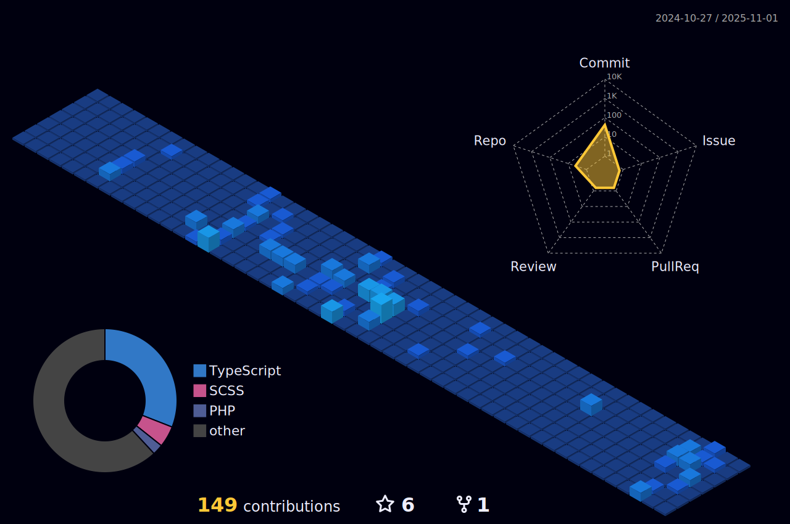

  

  I'm a passionate Front-End Developer with a strong foundation in HTML, CSS, and JavaScript. While I enjoy working with different frameworks, I'm currently diving deeper into Angular — and loving the structure and scalability it brings to building powerful web applications. I’m always curious, always learning, and always striving to write clean, efficient, and user-focused code.

  <h3>You can reach me by: </h3>
  
  
  

<!--   -->

<!-- https://media1.giphy.com/media/v1.Y2lkPTc5MGI3NjExNmlja3A4MDk4ZnR1cDFtcTBweGZjdTQ4bTdocXNlOG51bHB5cjRqaiZlcD12MV9pbnRlcm5hbF9naWZfYnlfaWQmY3Q9Zw/Hs1hQNAUQFpQQcQfGS/giphy.gif -->

  <h3>Web & Design</h3>
  

    <code></code>
  

  <h3>Languages & Frameworks</h3>
  

    <code></code>
  

  <h3>Tools</h3>
  

    <code></code>
  

  <h3>
    <i><b>GitHub Stats</b></i>
  </h3>

  <table>
    <tr>
      <td></td>
      <td></td>
    </tr>
    <tr> 
      <td></td>
      <td align="center">
          
      </td>
    </tr>
    <tr>
      <td colspan="2" align="center"></td>
    </tr>
    <tr>
      <td colspan="2" align="center"></td>
    </tr>
  </table>

  

  

    <h3><i><b>Spotify songs</b></i></h3>
    
    
  

