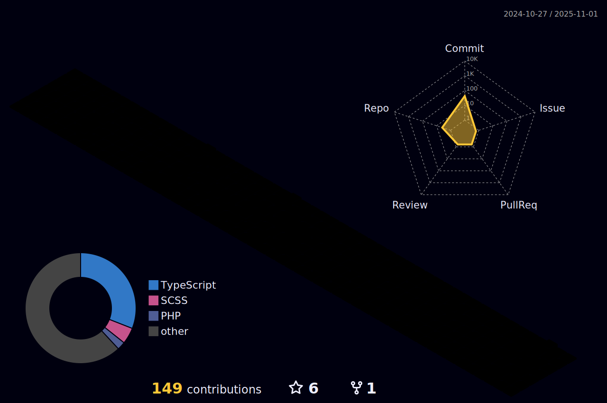

<h2 align="left">
  Hi, I am Franccesco Bordon 🫡
</h1>

  I'm a Front-End Developer (HTML, CSS & Javascript), I don't have a favorite framework, I like them all, but at the moment I'm studying Angular and I've really enjoyed it, especially for creating more powerful applications.

  <h3>You can reach me by: </h3>
  
  
  

<!--  -->

  <h4>Web & Design</h4>
  

    
  

  <h4>Languages & Frameworks</h4>
  

    
  

  <h4>Tools</h4>
  

    
  

  

    <i><b>GitHub Stats</b></i>
  

  <table>
    <tr>
      <td></td>
      <td></td>
    </tr>
    <tr> 
      <td></td>
      <td align="center">
          
      </td>
    </tr>
    <tr>
      <td colspan="2" align="center"></td>
    </tr>
    <tr>
      <td colspan="2" align="center"></td>
    </tr>
  </table>

  ### Spotify
  

